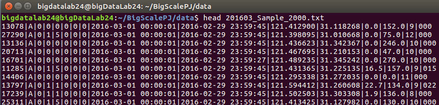
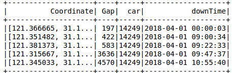
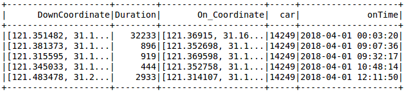
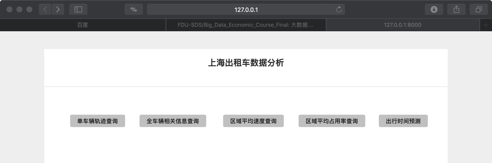
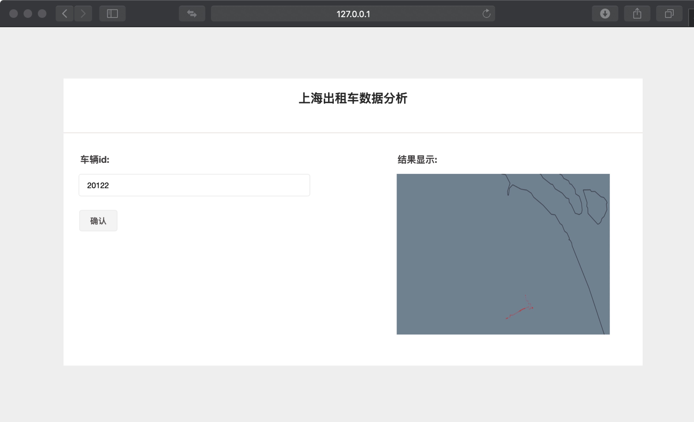
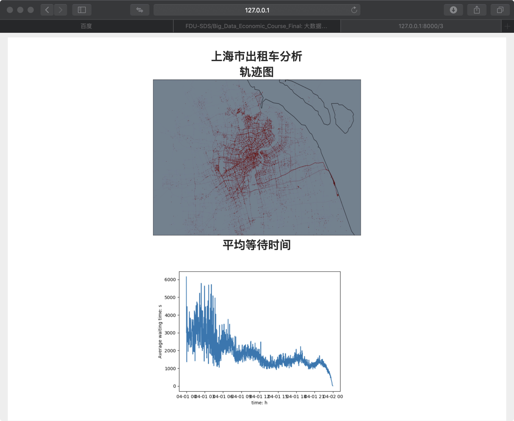
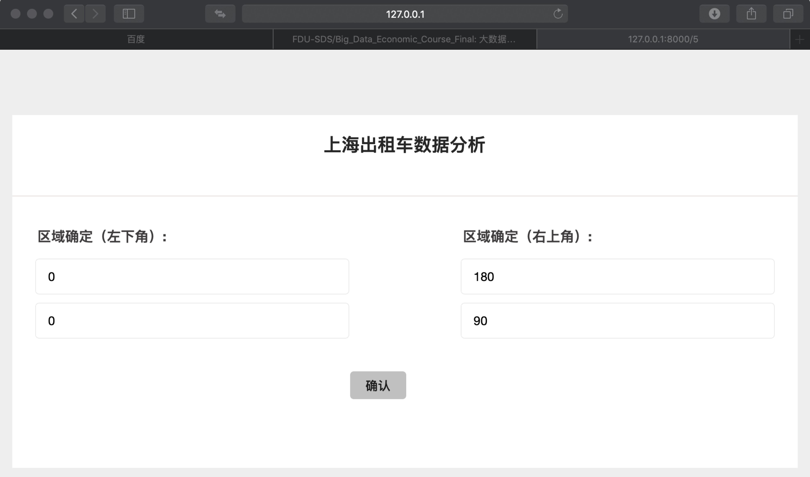
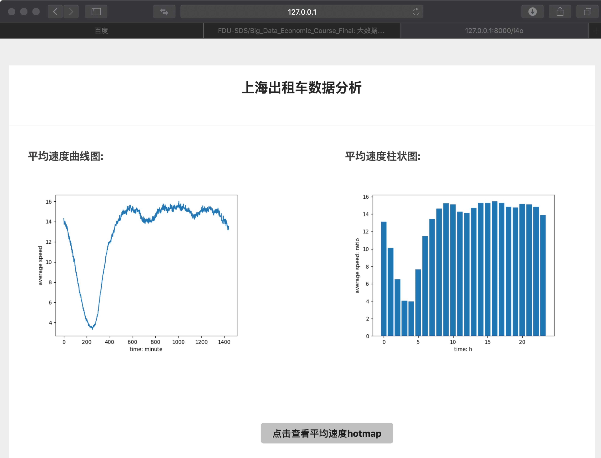
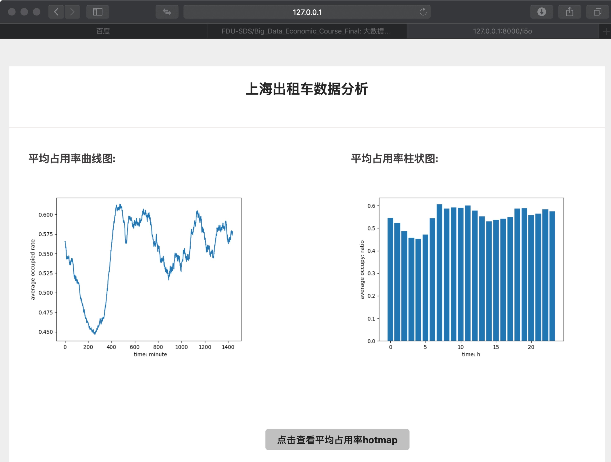
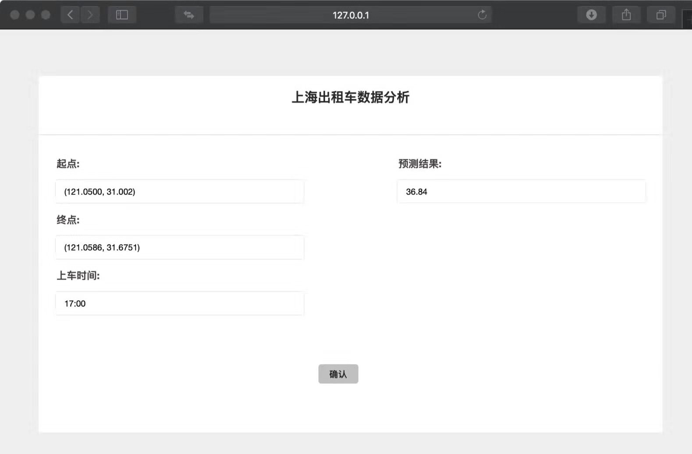

# 基于Spark的上海出租车信息查询系统

李泽君 16307130257  张奕朗 16307130242  崔铃钰 16307130297

### 1 引言

本项目是复旦大学大数据学院2019年春季学期《大规模分布式系统》的期末课程设计项目，目的在于利用在本课程中学到的分布式系统的相关知识和技术去分析和利用现实生活中的大数据。

受到老师提供的纽约出租车数据的启发，本项目选择了与我们生活息息相关的上海出租车大数据作为研究的对象，基于Spark平台开发了一个具有丰富功能和可视化效果的上海出租车信息查询系统，并在此系统的基础上分析了上海群众出租车出行的时空和轨迹特征，提出了自己的解释并从多个方面提出了建议。

##### 1.1 项目背景

当代的社会正逐步走向一个数据驱动的智能社会，更加完善的数据获取方式，更加系统的数据整合和储存手段，让我们息息相关的生活中能取得的数据逐渐成为了真正的大数据。指数级增长的数据量给数据的处理和分析带来了更多的困难，但是也带来了更多的可能性，从数据挖掘的角度，更多的样本量意味着更不容易过拟合，更小的方差和置信度更高的结论。所以利用合适的大规模处理框架去处理与生活息息相关的大数据将为我们带来更多启发，对社会现象更准确的分析结果和更深入的理解。其中，基数巨大且频率较高的交通数据作为一个最典型的大数据来源之一，其背后巨大的大数据价值正等待我们去发掘。

进入21世纪以来，应我国交通系统发展的需求，智慧交通的建设进入了高速发展期。基于移动计算技术和全球定位系统（GPS）以及其他形式的位置获取技术，可收集到大量移动交通对象的轨迹数据。通过对这些轨迹数据的分析挖掘，可以提取大量有效信息，服务于智慧交通建设，服务于人们日常生活。

在多种多样的交通方式中出租车在人们的日常出行中扮演了重要角色，是交通数据分析中不可缺少的组成部分。出租车有别于公交车、地铁等公共交通，具有没有固定线路和站点的特点，为个人出行提供定制化服务。因此出租车轨迹信息数据能够较为清晰反映出城市交通的状况，可挖掘分析人们的出行特点等信息。

##### 1.2 项目意义

出租车作为一种普遍而广泛的出行方式深受人们的青睐，作为一种交通形式而言，研究出租车数据能方便我们深入了解其在城市里的具体特征和出租车行业在该地区的发展状态。同样的，出租车的数据在一定程度上反映了该地区人口的流动性情况，出租车的行车轨迹与方式在一定程度上也能反映全市的整体的情况。而城市的道路和交通情况被称为一座城市的心跳与脉搏，深入理解出租车数据也有助于我们去分析城市内部与出租交通息息相关的特征与因素，从而在某些层面上为未来的城市改进提供了方向。

对于出租车数据的分析结果可用于城市规划，交通建设等多个方面，具有较强的应用意义。例如，提取热点轨迹，反映车辆行驶运动规律，可帮助政府了解城市道路情况，对于道路与交通路线规划和交通治理有重要价值，对个人了解出行的合适时间与费用以及交通服务质量也有积极作用；

提取出租车轨迹数据中的载客点和卸客点，可反映人们的出行习惯，乘车需求分布等信息，对车辆调度分配、运营策略调整等方面有较为有效的帮助；

对于车速和占用率的分析结果可以反映出租车行业在各个时间段和不同地区的分区差异，帮助改进部分道路设计和帮助出租车公司和司机寻找更好的工作方式。

对于个人而言，通过训练出的模型估计到达目的地所需的时间，帮助顾客（地图使用者）更好地评估所需时间和计算出发的时间以避免迟到等等。

##### 1.3 报告组成

本篇报告的剩余部分将分为五个部分，报告的第二、三部分对我们使用的数据集，我们项目的代码框架以及在代码框架里主要使用的工具和技术做了简单地介绍，给读者一个关于数据集所包含信息的大致映像，同时方便读者更好地理解本项目的工作流程和方式；

报告的第四部分将细致地根据不同的分类介绍我们的信息检索系统提供的功能和交互结果的展示，并且在每一个功能展示后，我们将会对功能展示出的结果做出自己的分析，也有助于读者理解每一个模块具体想要提供什么样的信息和背后设计的思想；

在第五部分中我们将总结整篇报告中的分析和结果，对上海市的出租车交通情况做一个大致的总结。并根据我们的数据和已有的成果从城市规划、道路设计和行人出行等方面提出了一些合理的建议。

报告的最后部分将是我们小组的分工介绍。

### 2 数据集介绍

##### 2.1 数据来源

启发自纽约出租车数据集的分析，我们尝试对我们生活的上海的出租车数据进行分析和挖掘，最终我们通过SODA（上海开放数据创新应用大赛）平台得到了上海强生出租车公司提供的出租车数据。上海强生出租车公司作为上海主要的出租车运营和管理公司之一，其提供的出租车数据基数大，发送频率高，能在一定程度上反映上海市的出租车交通的生态情况。

强生出租车公司的出租车每过10s会向公司数据总部发送一个信号，信号主要包括当前汽车所处的经纬度坐标、行车方向、速度、是否被占用（载客）、是否踩了刹车等等有关汽车或者GPS微型当前状况的属性。经过大致的统计，强生出租车公司在一天内收到的数据大约体量在1亿条以上。

##### 2.2 原始数据概览

数据根据不同的年月日，小时存放在不同的目录中，在同一个小时内，每个分钟段的数据被存放到同一个txt文件里，其命名就是对应的时间，比如’1804/01/23/1804012305.txt’文件就存放的是所有发出在2018年4月1日23时05分内的信号，每一行为一条信号，每一条信号里的不同信息段用’|’分隔，这里展示几条样例数据：

##### 2.3 数据特点与难点

相比于纽约出租车的数据（主要是上客和下客纪录），我们得到的数据相对而言不太一样，一个是数据频率更高，另一个是相对而言信息更多了，在保存数据的时候需要考虑筛去无效（不感兴趣）的信息，而且为了方便做类似于纽约出租车的上下客的相关分析和查询，我们决定从我们当前的数据表中提取出上客下客表，具体格式将会在下一部分介绍；

相较于纽约出租车的数据，我们更为准确地度量在一定特定的时间段内（时间段长度足够段代表时间点）的车辆分布情况和车辆相关状态的时空分布，比如速度，占用率等等，而这些我们感兴趣的信息都需要基于一个合理的数据和处理框架；

这里用一个动图来动态的展现车辆在时空的分布，这里的时间以一个小时为更新频率展现了上海市2018年4月1日的车辆分布和流动情况

（请用markdown或html或github主页查看该gif图片）：

### 3 项目框架与使用技术介绍

因为当前并不存在一个用于完成类似于我们的出租车信息的查询与可视化框架去学习，所以我们基于 Spark 的大规模数据处理框架，自主设计了我们的项目的代码框架，在本部分里，将详细介绍我们使用的技术和数据存放格式，代码框架的设计：

##### 3.1 使用技术

- 基本框架是 Spark，Spark 提供了对数据的读入，序列化以及一系列操作；
- 同时使用了两种各有优劣的 RDD 和 DataFrame 存储不同的数据表，基于两种变量类型完成查询，排序，展示等结果；
- 主要的处理方式是基于 Spark 提供的对序列化数据集的操作接口(如 map, filer 等)，主要的处理方式是 MapReduce；
- 基于 matplotlib 的统计图表可视化（折现趋势图和柱状分布图），还包括了使用 FuncAnimation 进行的动画(gif)制作；
- 基于 Basemap 和 folium 的地理信息可视化；
- 基于 Django 的网页前端实现；
- 基于 Python3 脚本的类的封装。

##### 3.2 数据表存放格式

对于一个数据表，会同时维护一个 RDD 和一个 DataFrame ，因为相对而言 DataFrame 的运行速度稍微快一些，而RDD支持的基本操作类型更多，为了方便后续操作，在初始化过程中对原始数据集所在的RDD按照时间进行排序；

从一个司机的角度出发，我们需要考虑在某时刻某地将乘客放下后下一次接到单所需要的时间，所以建立了一个下客记录表（ GroupByKey 后遍历值数组来找到出租车从有客人到没客人的记录和下一次拉客的信息），其 Schema 如下：

从一个乘客的角度出发，我么你需要考虑的是在某时某刻在某地乘上一辆出租车到达目的地所需要的时间长度，所以我们又建立了一个上客记录表（同样是 GroupByKey 后遍历值数组来找到客人上车的记录和该乘客的下车信息），其 Schema 如下：

对于原始的数据我们也是一样保存了有 RDD 和 DataFrame 的变量，一方面是因为我们的一些查询语句在原数据集上更快更直接，另外一方面是保存完整的血源图的祖先结点的信息，保证代码的完整性；

##### 3.3 代码框架结构

基于面向对象的思想，我们希望将我们的对于数据集的操作，查询，可视化的一系列操作包装成一个面向对象的类 Query，在使用的时候需要首先声明实例化一个 Query 类的变量，然后通过提供的接口进行对应的操作，这里对于 Query 类提供的主要成员和主要方法做一个简单的说明：

Query:
- Member:
  - `self.sc`, `self.spark`：保存用于与Spark服务器通信的spark context和spark session变量；
  - `self.data`, `self.df`：存放分割后的原始数据的RDD和有Schema的DF
  - `self.upRecord`, `self.downRecord`: 保存处理后的上下客记录表，使用前需要调用self.init_updown来对两个表进行初始化
- Method:
  - `self.init_updown()`：用来初始化上下客表，未调用前均为None
  - `self.GetAverageWaitTime()`：输入两个对角的坐标限制出一个矩形区域和时间，计算该时间空间内部司机下客后平均需要的等待下一单时间
  - `self.AverageWaitTimePlot()`：将上述结果以1min为频率展现为折现趋势图
  - …… 其他的类似的查询有关方法
  - `self.drawOneCar()`：使用Basemap可视化某车辆在一天的行驶轨迹并储存png
  - `self.drawAllCars()`：可视化在某个小时内所有车辆的分布
  - `self.carHotMap()`：产生车辆分布的热力图（粒度和阈值已调整到合适位置）
  - …… 其他的轨迹可视化与热力图可视化
  - `self.tourTimePredict_train()`：训练预测所需乘车时间的模型
  - `self.tourTimePredict()` ：基于模型进行预测

以上就是Query类提供部分重要的成员和方法，比较相同的部分就选择了一到两个函数作为罗列，其余的比较类似。基于Django的UI代码框架相对而言比较难以理解，将在第四部分结合着我们最终的用户界面进行介绍。

### 4 具体功能介绍及分析

本项目的UI是基于Django开发的基于网页的UI，在这里将选取几个主要且我们比较感兴趣的功能进行界面和结果截图展示，对于一些结果还加上了简要的进行分析和阐述自己的理解；

##### 4.1 主界面

在主界面中，首先我们为用户提供了四类信息的查询和可视化接口和一类信息预测查询，分别为：

- 单车轨迹查询：单个车辆全区域轨迹查询可视化；
- 全车辆相关信息查询：全体车辆全区域信息可视化，含轨迹和平均等待时间；
- 区域平均速度查询：对于区域定位的平均速度相关信息可视化，含基本折线图柱状图及热力图展示；
- 区域平均占用率查询：对于区域定位的平均占用率相关信息可视化（含基本折线图柱状图及热力图展示）；
- 出行时间预测：对于给定起止点和上车时间的出行时间预测。

下面会分别展示和分析这五个部分。

##### 4.2 单车轨迹查询与可视化

对于单车辆的轨迹查询和现实，可以通过输入对应的车辆的ID然后系统自动产生在该天内的运行轨迹，在这里没有输入车辆ID的话会使用默认的值作为选择的车辆，可以看出该车辆在一天之内几乎就是沿着某一条路一直往返，可能是因为该车辆当天的运营时间比较短，就顺着这条路完成了几次拉载客。

通过观察多辆出租车的一日轨迹特征我们发现，其实绝大多数出租车在一天以内的活动范围都是比较有限的，说明司机都比较了解哪些地方容易拉到客人，而且前往的地点也比较集中，而且往往一次拉客的过程平均不会太长，在局部模式化明显。

##### 4.3 多车辆轨迹查询与可视化

在此我们对单日上海地区全部出租车数据进行了轨迹可视化（实为动态展示，见**2.3**中的gif图片）和等待时间分析。可以看出车辆轨迹基本呈现夜晚由市中心向外扩散，而在清晨从外向市中心集中的变化情况。车辆等待时间较为明显的低谷出现在凌晨时间段，此时间段的出租车需求小于出租车供给；较明显的波峰出现在早高峰时期，此时间段的出租车需求大于出租车供给。

##### 4.4 平均速度查询

通过输入希望查询的地图区域经纬度坐标，输出该区域的平均车辆速度的相关信息。分析全区域车辆平均运行速度相关信息，可得到初步结论。从时间角度分析：出租车运行速度波谷为2-4点，此状态下一般为出租车空车状态较多，印证符合前两项分析结论。；其余时间无明显差别。从地理空间角度分析（由热力图可见）：平均行驶速度与地区路况有较为明显的联系，在高架路高速路等区域明显呈现高平均速度状态。

（请用markdown或html或github主页查看该gif图片）

##### 4.5 平均占用率统计查询

通过输入希望查询的地图区域经纬度坐标，输出该区域的平均占用率的相关信息。分析全区域占用率相关信息，可得到初步结论：占用率基本波动于50%；较为明显的博古波谷出现在凌晨2-4点，波峰出现在7-8点，这也印证了在等待时间中的分析。占用率基本呈现与等待时间成反比的状态，符合现实认知中的供给需求关系。热力图和**4.4**相似，此处略。

##### 4.6 出行时间预测

通过机器学习获得出租车出行时间预测的模型（模型对空间和时间采用onehot编码并进行岭回归，详见代码）：输入出行的起止点，输出基于上海市出租车数据情况的对于出行时间的预测结果（以min为单位）。这里我们选用车辆密度较大的区域和晚高峰进行测试，发现出行时间明显变长，与实际情况相一致。

### 5 结论与建议

在观察车辆分布和轨迹的可视化动态图或静态图中，我们发现了很多的规律，这些规律和上海市的人口分布和人口流动特性息息相关；而平均占用率，平均速度所随时间变化的折线趋势图则为我们提供了更多对于出租车生态，甚至是交通系统的特点的估计；同样的，用于表现出现的集中程度或者是属性高低分布的热力图则帮助我们探索了交通系统中某些属性的时空分布，在本部分中，我们将对之前的分析和发现进行精炼和总结，最后提出我们的几点建议。

首先是几点最重要的发现：

- 观察出租车分布的动态图可以看出出租车的分布随时间的变化非常规律，即夜晚由市中心向外扩散，而在清晨从外向市中心集中，白天则主要围绕着二环以内区域进行小幅度的变化；

- 夜间出租车向外扩散时，宝山区附近（北上方区域）出租车很集中，白天则很少，说明很多出租车夜晚凌晨倾向于开到宝山区附近进行休息，可能是因为宝山区主要是生活区，司机们很多人家住在该区域；
- 观察起止点的分布图可以看出，上车点和下车点都呈现很小的簇状结构，也就是在一些小范围的区域会打车点众多且密集，这些点在23点更加明显得集中，也就是上车点集中在商圈和娱乐场所，下车点相对没那么密集，集中在生活区，也说明下车点选择更多样化；
- 从热力图可以看出虹桥火车站和浦东国际机场是在几乎所有时间点都是热门的打车和出租车集中的位置，而相对而言这样稳定的点在市内几乎没有（市内无稳定热门打车点）；
- 一天内的平均车速呈现了三个局部波谷的特点，通过观察时间易知是一天的凌晨（出租车休息），早晚高峰，而观察速度的热力图可以看出平均速度和该区域的路况有关，有高架的高速路多数时间呈现红色（高平均速度）；
- 一天内的平均占用率波动相对较大，不过也能观察到三个明显的局部最小点，分别是凌晨（休息，乘客少），下午2-3点（工作），晚上8点作业（很少出门）；
- 对于司机下客后距离下一次接单平均所需的等待时间则波动较大，总体的表现上来看，凌晨最高，白天内差异不大，在接近24点的时候迅速下降（娱乐等活动结束后的回家潮）；
- 上海的出租车司机常常会有一些接远单的现象，比如将乘客送到苏州等

借此，我们可以大致给出一些简单的结论：

- 上海市的出租车的运行分布规律性很强，其随时间的流动规律代表了人口在市内的主要流动趋势（上班，下班，娱乐，回家等流动大潮）；
- 存在很多的显著热门打车点或者是出租车集中点，比如机场，火车站，凌晨的宝山区，接近24点的娱乐中心，模式性很强；
- 白天（9:00-17:00）时间段上海的人口流动量相对少；

通过以上的讨论，我们从上海市出租车管理局、乘客、出租车司机三个角度提出了几条建议：

- 作为出租车管理局，效仿在虹桥火车站、浦东机场的出租车站台的模式，可以在市中心多增加一些这样的点（可以选点在我们的上车点的聚集簇中心），这样有助于集中打车人和出租车，降低混乱度，同时也方便出租车司机去一些特定目的地拉客而不是浪费时间；可以适当地多研究分析平均车速都比较低的点，这些点说明交通状况经常不容乐观，值得去改善；分析人口流动的趋势和时间点来重新规划高速路开放时间，红绿灯时间优化；
- 作为乘客，我们可以利用之前找到的几个峰值点来帮助我们有效避开高峰，比如在娱乐场所接近24点前早一些离开打车；在和司机信息对等的情况下（都知道热门的打车点）的情况下可以多去这些点打车；
- 作为出租车司机，在可能的情况下，要尽量多地前往一些热门打车点去寻找客单，如果接近机场或者火车站，前往接单是个好主意；尽量选择高速路防止拥堵或者是路况不佳导致效率降低；如果有时间和精力可以自己规划出最适合自己的一块运营区域（打车点多且容易连续接单）。

### 6 小组分工

- 李泽君 16307130257：数据获取、出租车轨迹分析、出租车司机平均等待时间分析、出租车起止点分析、可视化
- 张奕朗 16307130242：出租车平均行驶速度分析、出租车平均占用率分析、基于机器学习的出租车出行时间预测、可视化
- 崔铃钰 16307130297：数据可视化、数据分析、前端开发。